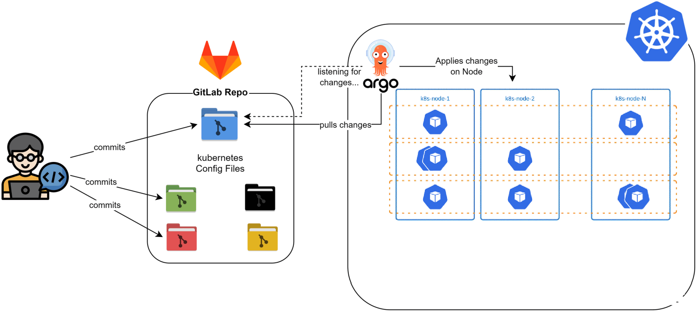

# Bonita Cloud - DevOps Cloud Technical Challenge

This repository contains the solutions and documentation for the DevOps Cloud technical challenge. The challenge involves deploying Bonita Community using its official Docker image in a Kubernetes cluster, with variations in configuration and database setup.

 The solution for this challenge is deployed on a kubernetes cluster and can be accessed at [http://34.163.46.195/bonita/](http://34.163.46.195/bonita/).

## Work Environment

In my usual development setup, I opt for an on-premises Kubernetes cluster hosted on Google Cloud, which I provision using Infrastructure as Code (IaC) tools including Ansible, Terraform. My local machine's performance limitations led me to this approach. This setup allows me to have a more hands-on experience with managing Kubernetes clusters.

The configuration and automated scripts for setting up this Kubernetes cluster are part of a separate project, which can be found here: [k8s-on-premises-gcp](https://gitlab.com/Hamdane10/k8s-on-premises-gcp).

I prefer using my self-managed Kubernetes cluster instead of GKE (Google Kubernetes Engine) primarily for learning purposes. It provides a more in-depth understanding of Kubernetes' inner workings and cluster management.

For this challenge, I have utilized an automated process where Argo CD is pre-deployed and configured in my Kubernetes cluster.

Argo CD is set to fetch updates from the [`k8s-manifests`](https://gitlab.com/Hamdane10/bonita-soft-challenge/-/tree/main/k8s-manifests?ref_type=heads) directory in this repository, streamlining the deployment of my Kubernetes configurations. While I find Argo CD to be a convenient tool for this purpose, I acknowledge that it's a matter of trade-offs and not necessarily the ultimate solution. It's about finding the right balance for each project's needs.

## Repository Structure Overview

- **[`set_logging_level_to_info.sh`](https://gitlab.com/Hamdane10/bonita-soft-challenge/-/blob/cc90d56e2286657c2b4323afd30634a89c07479f/set_logging_level_to_info.sh)**:
  - *Purpose*: Modifies the [`log4j2-appenders.xml`](https://raw.githubusercontent.com/bonitasoft/bonita-distrib/9.0.0/docker/files/log4j2/log4j2-appenders.xml) file to set the log level to INFO for the Bonita application.
  - *Role*: Essential for increasing log verbosity as part of User Story 2.

- **[`env`](https://gitlab.com/Hamdane10/bonita-soft-challenge/-/blob/cc90d56e2286657c2b4323afd30634a89c07479f/env)**:
  - *Purpose*: Provides environment variables for the Bonita application's database connection.
  - *Role*: Used to create the 'db-connect-config' ConfigMap, detailing database connection specifics.

### [`k8s-manifests`](https://gitlab.com/Hamdane10/bonita-soft-challenge/-/tree/main/k8s-manifests?ref_type=heads) Directory

- **[`bonita-hpa.yaml`](https://gitlab.com/Hamdane10/bonita-soft-challenge/-/blob/cc90d56e2286657c2b4323afd30634a89c07479f/k8s-manifests/bonita-hpa.yaml)**:
  - *Purpose*: Defines the Horizontal Pod Autoscaler for Bonita.
  - *Role*: Automates scaling of Bonita pods based on CPU utilization, with a range of 1 to 5 pods.

- **[`bonita-ns.yaml`](https://gitlab.com/Hamdane10/bonita-soft-challenge/-/blob/cc90d56e2286657c2b4323afd30634a89c07479f/k8s-manifests/bonita-ns.yaml)**:
  - *Purpose*: Creates a Kubernetes namespace 'bonita'.
  - *Role*: Isolates Bonita-related resources within its own namespace.

- **[`bonita-sa.yaml`](https://gitlab.com/Hamdane10/bonita-soft-challenge/-/blob/cc90d56e2286657c2b4323afd30634a89c07479f/k8s-manifests/bonita-sa.yaml)**:
  - *Purpose*: Establishes a ServiceAccount 'bonita-service-account'.
  - *Role*: Provides a specific identity for processes running in the 'bonita' namespace.

- **[`config.yaml`](https://gitlab.com/Hamdane10/bonita-soft-challenge/-/blob/cc90d56e2286657c2b4323afd30634a89c07479f/k8s-manifests/config.yaml)**:
  - *Purpose*: Stores configuration and script for setting log level.
  - *Role*: Includes 'db-connect-config' ConfigMap for database configuration and 'bonita-custom-init' ConfigMap for the logging script.

- **[`deploy-bonita.yaml`](https://gitlab.com/Hamdane10/bonita-soft-challenge/-/blob/cc90d56e2286657c2b4323afd30634a89c07479f/k8s-manifests/deploy-bonita.yaml)**:
  - *Purpose*: Kubernetes Service and Deployment definitions for Bonita.
  - *Role*: Exposes the Bonita application and defines its deployment, including the use of init containers for script execution.

- **[`network-policy.yaml`](https://gitlab.com/Hamdane10/bonita-soft-challenge/-/blob/cc90d56e2286657c2b4323afd30634a89c07479f/k8s-manifests/network-policy.yaml)**:
  - *Purpose*: NetworkPolicy to control access to the PostgreSQL database.
  - *Role*: Restricts network traffic to the database, allowing only specific pods.

- **[`resource-quota.yaml`](https://gitlab.com/Hamdane10/bonita-soft-challenge/-/blob/cc90d56e2286657c2b4323afd30634a89c07479f/k8s-manifests/resource-quota.yaml)**:
  - *Purpose*: Sets resource consumption limits and requests in the 'bonita' namespace.
  - *Role*: Ensures efficient and fair use of resources across all pods in the namespace.

- **[`secret-reader-role-binder.yaml`](https://gitlab.com/Hamdane10/bonita-soft-challenge/-/blob/cc90d56e2286657c2b4323afd30634a89c07479f/k8s-manifests/secret-reader-role-binder.yaml)** and **[`secrets-rbac.yaml`](https://gitlab.com/Hamdane10/bonita-soft-challenge/-/blob/cc90d56e2286657c2b4323afd30634a89c07479f/k8s-manifests/secrets-rbac.yaml)**:
  - *Purpose*: Defines RBAC roles and bindings for accessing Kubernetes Secrets.
  - *Role*: Grants read-only access to Secrets, enhancing security by adhering to the principle of least privilege.

- **[`statefulset-bonita-db.yaml`](https://gitlab.com/Hamdane10/bonita-soft-challenge/-/blob/cc90d56e2286657c2b4323afd30634a89c07479f/k8s-manifests/statefulset-bonita-db.yaml)**:
  - *Purpose*: Defines the StatefulSet for the PostgreSQL database and its storage.
  - *Role*: Manages the database deployment, ensuring persistent storage and stable identity for pods.

Each file in this repository plays a specific role in the deployment, configuration, and management of the Bonita application and its components in a Kubernetes environment.

## User Story 1 - Bonita Community Deployment

In the initial phase of the challenge, I deployed the Bonita Community edition using a Kubernetes Deployment object. This deployment was configured to have one replica for maintaining a single instance of the Bonita application.

- Bonita Community Deployment Definition: [`deploy-bonita.yaml`](https://gitlab.com/Hamdane10/bonita-soft-challenge/-/blob/cc90d56e2286657c2b4323afd30634a89c07479f/k8s-manifests/deploy-bonita.yaml)

The configuration of the Bonita application was managed using Kubernetes ConfigMap and Secret objects. The ConfigMap contains non-sensitive configuration data, while the Secret object stores sensitive credentials, it's important to note that Secrets in Kubernetes are base64 encoded, not encrypted, there are practices to enhance their security like using a HashiCorp Vault or enable Kubernetes to encrypt Secret data at rest in the etcd database.

- Configuration and Secrets: [`config.yaml`](https://gitlab.com/Hamdane10/bonita-soft-challenge/-/blob/cc90d56e2286657c2b4323afd30634a89c07479f/k8s-manifests/config.yaml)

By default, Bonita Community comes with an H2 database, which is an in-memory database. While suitable for testing, the H2 database is not recommended for production use due to its lack of persistence.

To address this, I added a PostgreSQL database using the Docker image provided by Bonita. For the database deployment, I used a Kubernetes StatefulSet object. This choice is crucial when working with stateful applications like databases because StatefulSets provide stable, unique network identifiers, stable, persistent storage, and ordered, graceful deployment and scaling.

- PostgreSQL Database StatefulSet Configuration: [`statefulset-bonita-db.yaml`](https://gitlab.com/Hamdane10/bonita-soft-challenge/-/blob/cc90d56e2286657c2b4323afd30634a89c07479f/k8s-manifests/statefulset-bonita-db.yaml)

The StatefulSet was configured with one replica, ensuring a single, consistent database instance. Additionally, a local PersistentVolume was used to persist the data of the PostgreSQL database. This setup is ideal for testing, but for production environments, integrating with external storage solutions like Google Cloud Storage is advisable for better data management and resilience.

### Configuring Communication with Kubernetes Services

In Kubernetes, Services are used to enable communication between different applications or between parts of the same application. Services provide a stable DNS and IP address, allowing for reliable internal communication.

- **Database Service**: For Bonita to communicate with the PostgreSQL database, a Service `bonita-db` is used.
- **Exposing Bonita Externally**: The Bonita application is exposed outside the Kubernetes cluster using a NodePort Service `bonita`. While NodePort Services are simple and convenient for development and testing, they are not the ideal solution for production environments. In production, it's recommended to use a LoadBalancer Service or an Ingress Controller for more robust and scalable external access.

## User Story 2 - Custom Log Verbosity

In this part of the challenge, I aimed to modify the default log verbosity level of the Bonita application from `WARNING` to `INFO`. My first step was to explore how logging is configured in Bonita, leading me to discover that it uses the log4j2 library. The key configuration files for logging are [`log4j2-loggers.xml`](https://raw.githubusercontent.com/bonitasoft/bonita-distrib/9.0.0/tomcat-resources/tomcat-distrib-for-bonita/src/main/resources/tomcat/server/conf/log4j2-loggers.xml) and [`log4j2-appenders.xml`](https://raw.githubusercontent.com/bonitasoft/bonita-distrib/9.0.0/docker/files/log4j2/log4j2-appenders.xml), located in `/opt/bonita/conf/logs/`.

Not having extensive knowledge of log4j2, I focused on what seemed like the most direct approach: modifying the root level in [`log4j2-appenders.xml`](https://raw.githubusercontent.com/bonitasoft/bonita-distrib/9.0.0/docker/files/log4j2/log4j2-appenders.xml). However, I must note that I wasn't entirely certain this was the correct method due to my limited familiarity with log4j2. Despite this, I decided to proceed with this approach for the purpose of the challenge.

I created a bash script, [`set_logging_level_to_info.sh`](https://gitlab.com/Hamdane10/bonita-soft-challenge/-/blob/cc90d56e2286657c2b4323afd30634a89c07479f/set_logging_level_to_info.sh), which programmatically adjusts the root level in [`log4j2-appenders.xml`](https://raw.githubusercontent.com/bonitasoft/bonita-distrib/9.0.0/docker/files/log4j2/log4j2-appenders.xml) to `INFO`.

### Implementing the Change Using an Init Container

To execute this script before the main Bonita application starts, it had to be placed in the `/opt/custom-init.d` directory inside the container. This was achieved through several steps:

1. **Creating a ConfigMap**: The script was stored in a ConfigMap named [`bonita-custom-init`]((https://gitlab.com/Hamdane10/bonita-soft-challenge/-/blob/cc90d56e2286657c2b4323afd30634a89c07479f/k8s-manifests/config.yaml))
2. **Using an Init Container**: The [Deployment configuration]((https://gitlab.com/Hamdane10/bonita-soft-challenge/-/blob/cc90d56e2286657c2b4323afd30634a89c07479f/k8s-manifests/deploy-bonita.yaml)) was modified to include an init container. This approach was necessary because directly placing the script inside the main container would lead to errors, as the file system would be locked in read-only mode. The init container copies the script from the ConfigMap to `/opt/custom-init.d`.
3. **Execution Before Main Application Starts**: The init container ensures that the script is executed before the main Bonita application container starts, setting the logging level to `INFO` right from the application's launch.

Following these steps, I successfully altered the default logging verbosity of Bonita to `INFO`. This method, while unverified for its accuracy in the context of log4j2, meets the challenge's requirement for a repeatable solution using a bash script.

## Ensuring Application Isolation and Resource Management

For this project, several Kubernetes best practices were implemented to ensure efficient application isolation and resource management.

### Utilizing Namespaces for Isolation

- **[Namespace `bonita`](https://gitlab.com/Hamdane10/bonita-soft-challenge/-/blob/cc90d56e2286657c2b4323afd30634a89c07479f/k8s-manifests/bonita-ns.yaml)**: A dedicated namespace was created for the Bonita application. Using namespaces in Kubernetes is crucial for isolating resources, which helps in organizing and securing components of different applications or environments within the same cluster.

- The namespace provides a segregated environment where all resources related to the Bonita deployment, including services, deployments, and stateful sets, are confined. This ensures a clean separation from other applications or services running in the same cluster.

### Implementing Resource Quotas for Efficient Utilization

- **[Resource Quota](https://gitlab.com/Hamdane10/bonita-soft-challenge/-/blob/cc90d56e2286657c2b4323afd30634a89c07479f/k8s-manifests/resource-quota.yaml)**: A ResourceQuota object was defined for the `bonita` namespace. This is a crucial step in managing the resources effectively in the Kubernetes cluster. It helps in preventing any single namespace from overconsuming resources, which could impact other services or the overall health of the cluster.

- The ResourceQuota specifies limits on CPU and memory usage for all pods within the namespace. By setting these limits, we ensure fair resource distribution and avoid scenarios where one application could potentially deplete resources needed by others.

### Setting Resource Requests and Limits

- **Resource Allocation**: For both the Bonita application and the PostgreSQL database, specific resource requests and limits were set. This practice is vital in Kubernetes to ensure that each application has enough resources to function optimally while preventing any application from using more than its fair share of resources.

- The values for memory and CPU requests and limits were set based on the documentation and recommendations for Bonita and PostgreSQL. However, as I do not have deep knowledge of the exact resource consumption of these applications, the specified values are based on general guidelines and may need adjustments based on actual usage patterns and performance metrics.

## Enhancing Security in Kubernetes

The deployment of the Bonita application includes several measures to improve security and protect both the application and its data. These measures demonstrate examples of security configurations in Kubernetes, although they represent just a fraction of what can be accomplished in a comprehensive security setup.

### Network Policy for Controlled Access

- **NetworkPolicy [`bonita-db-access`](https://gitlab.com/Hamdane10/bonita-soft-challenge/-/blob/cc90d56e2286657c2b4323afd30634a89c07479f/k8s-manifests/network-policy.yaml)**: This NetworkPolicy enhances the security of the Bonita application by controlling network access to the PostgreSQL database (`bonita-db`). It ensures that only the pods running the Bonita application (labeled with `app: bonita`) can communicate with the database pods (labeled with `app: bonita-db`). This restriction is specifically enforced on TCP port 5432, which is the standard port for PostgreSQL. Such a policy is crucial to prevent unauthorized access to the database from other components in the cluster.

### RBAC for Secure Access to Kubernetes Resources

- **ServiceAccount [`bonita-service-account`](https://gitlab.com/Hamdane10/bonita-soft-challenge/-/blob/cc90d56e2286657c2b4323afd30634a89c07479f/k8s-manifests/bonita-sa.yaml)**: This ServiceAccount provides a dedicated identity for the Bonita application processes running in the Kubernetes cluster. Using a specific ServiceAccount for an application is a good practice for ensuring that processes have only the permissions they need.

- **Role [`secret-reader`](https://gitlab.com/Hamdane10/bonita-soft-challenge/-/blob/cc90d56e2286657c2b4323afd30634a89c07479f/k8s-manifests/secrets-rbac.yaml) and [RoleBinding](https://gitlab.com/Hamdane10/bonita-soft-challenge/-/blob/cc90d56e2286657c2b4323afd30634a89c07479f/k8s-manifests/secret-reader-role-binder.yaml)**: The Role [`secret-reader`](https://gitlab.com/Hamdane10/bonita-soft-challenge/-/blob/cc90d56e2286657c2b4323afd30634a89c07479f/k8s-manifests/secrets-rbac.yaml) grants read-only access to Secrets within the `bonita` namespace, aligning with the principle of least privilege. This RoleBinding then associates this role with the [`bonita-service-account`](https://gitlab.com/Hamdane10/bonita-soft-challenge/-/blob/cc90d56e2286657c2b4323afd30634a89c07479f/k8s-manifests/bonita-sa.yaml). By doing this, the Bonita application is restricted to only viewing Secrets and cannot modify them. This setup enhances the security posture by minimizing the potential for accidental or malicious alterations to sensitive data.

These security configurations in the Kubernetes environment are vital for maintaining the integrity and security of the applications and their data. While these steps provide a foundational level of security, further security measures can be implemented based on the specific needs and architecture of the Kubernetes deployment.

## Implementing Health Checks for Application Reliability

This section outlines the implementation of health checks in the Kubernetes deployment, crucial for maintaining the reliability and optimal functioning of both the Bonita application and the associated PostgreSQL database.

### Liveness and Readiness Probes in Bonita Deployment

- **Purpose**: Liveness probes help determine if the application is alive and functioning correctly, while readiness probes assess if it's ready to handle requests.
- **Configuration for Bonita**: The deployment uses basic HTTP probes to check the root path (`/`). Ideally, for subscription editions of Bonita, the endpoint `/bonita/healthz` should be used. My access attempts were unsuccessful, possibly indicating its availability exclusively in subscription editions.
- **Initial Delay and Period Settings**: The `initialDelaySeconds` and `periodSeconds` values are set based on general guidelines. Precise tuning of these parameters would require an in-depth understanding of Bonita's operational dynamics, which is beyond my current knowledge scope.

### Health Checks for the PostgreSQL Database

- **Health Check Script**: The StatefulSet for the PostgreSQL database utilizes an existing script, `/usr/local/bin/healthcheck.sh`, for both liveness and readiness probes. This script is adapted from [Bonita's PostgreSQL Docker configuration](https://github.com/Bonitasoft-Community/bonita-database-docker/blob/main/postgres/12/healthcheck.sh) and effectively validates the operational status and connection readiness of the database.

- **Script Functionality**: It ensures that the database is not just operational but also primed to accept connections, a vital aspect for the seamless functionality of the Bonita application.

By integrating these health checks, the Kubernetes deployment gains an automated mechanism to monitor and address service issues, such as restarting non-responsive pods. This enhances the overall availability and reliability of the deployed services.

## Exposing the Application Externally

In the current setup, the Bonita application is exposed to external traffic using a NodePort service. While this approach is functional, it's important to understand its limitations and why it's typically reserved for development and testing environments, rather than production.

### Limitations of NodePort Services

- **NodePort for Testing and Development**: NodePort services expose applications on a specific port on all nodes in the cluster. This is straightforward but not ideal for production due to several reasons:
  - **Limited Security**: Exposing every node's IP can be a security risk.
  - **Lack of Scalability**: NodePort services don't inherently support load balancing across multiple nodes, leading to potential bottlenecks.
  - **Port Management**: They require managing port conflicts and can use only a specific range of ports.

### Standard Practices for Exposing Applications in Production

- **LoadBalancer Service Type**: A LoadBalancer service creates an external load balancer (when the cluster is running in a cloud provider environment) and assigns a fixed, external IP address to the service. It's used when simple routing with a dedicated IP for each service is sufficient.

- **Ingress Controllers and Ingress Resources**: For more complex routing, an Ingress resource is used in conjunction with an Ingress controller (like NGINX). It allows path-based routing to different services and is generally the standard for exposing web applications in Kubernetes.

- **Why Not Ingress in This Case**: Implementing an Ingress controller requires integration with a cloud provider's load balancer to assign an external IP. In my case, using an on-premises Kubernetes cluster without a cloud provider's load balancer made this approach unfeasible within the given time constraints.

### Current Access Setup

- **Access via HAProxy Load Balancer**: Despite the Bonita application being exposed through a NodePort, it is currently accessible at [http://34.163.46.195/bonita/](http://34.163.46.195/bonita/) on port 80. This is achieved by using an HAProxy load balancer that routes incoming traffic on port 80 to the appropriate NodePort on the Kubernetes nodes. This setup demonstrates a workaround for the limitations of NodePort but still essentially relies on NodePort beneath the surface.

In summary, while NodePort services offer a quick way to expose applications externally, they are not suited for production environments. More robust methods like LoadBalancer services or Ingress controllers should be considered for scalable, secure, and efficient external exposure of applications in Kubernetes.

## Scalability

For the Bonita application, a basic setup for scalability has been implemented using the Horizontal Pod Autoscaler (HPA). This setup ensures that the Bonita application can handle varying loads by automatically adjusting the number of running pods.

### Horizontal Pod Autoscaler (HPA) for Bonita Deployment

- **HPA Configuration**: The HPA [`bonita-hpa`](https://gitlab.com/Hamdane10/bonita-soft-challenge/-/blob/cc90d56e2286657c2b4323afd30634a89c07479f/k8s-manifests/bonita-hpa.yaml), defined in the Bonita namespace, targets the Bonita Deployment. It automatically scales the number of pods based on the observed CPU utilization.

- **Scaling Parameters**:

  - **Minimum and Maximum Replicas**: The HPA is configured to maintain a minimum of 1 pod and can scale up to a maximum of 5 pods. This range provides a balance between resource utilization and the ability to handle increased load.

  - **CPU Utilization Target**: The scaling decision is based on CPU utilization, with a target set at 80%. If the average CPU utilization across all pods exceeds this threshold, the HPA triggers the creation of additional pods (up to the maximum defined).

  - **Scaling Down Behavior**: The HPA also includes policies for scaling down, such as a stabilization window and the rate at which pods are removed, ensuring that scale-down activities do not negatively impact the application's availability.

### Considerations for Database Scaling

- **Database Statefulness**: For stateful components like databases, horizontal scaling (adding more replicas) is more complex due to the persistent nature of their data. In this deployment, the PostgreSQL database is managed using a StatefulSet, which is typically scaled vertically (increasing resources of existing pods) rather than horizontally.
